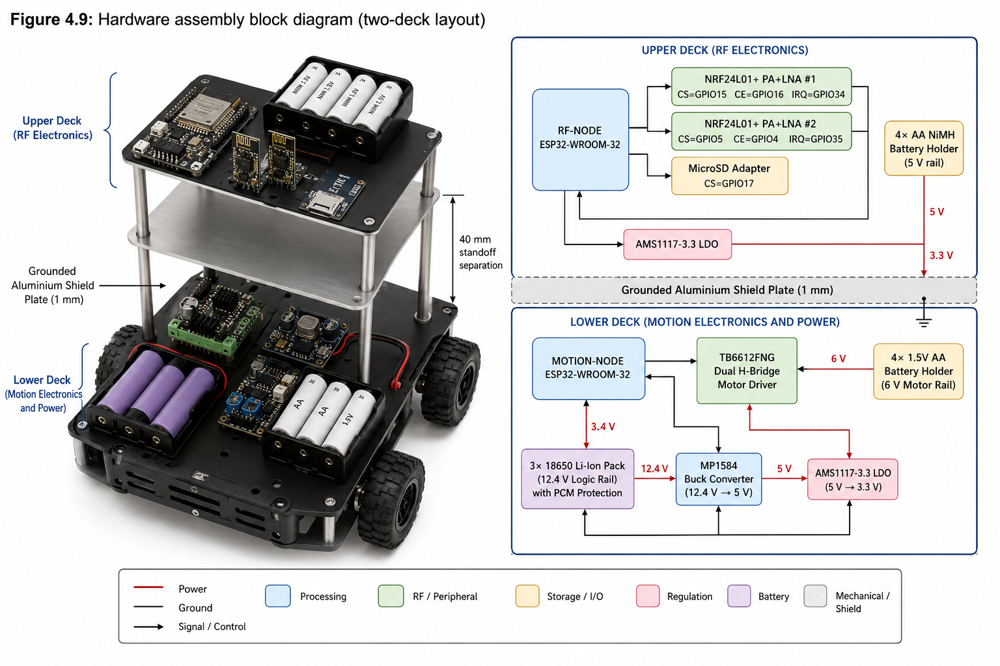
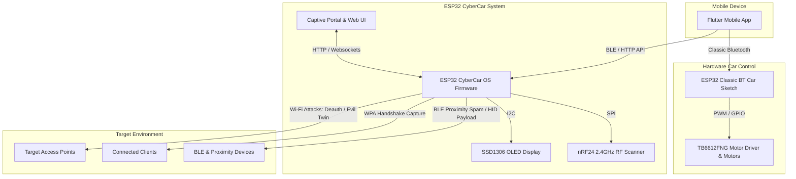

# CyberCar Beta 🚗💨

<div align="center">
  
  <p><em>An Integrated Wireless Security Research Firmware and Mobile Controller Ecosystem</em></p>
</div>

---

[](LICENSE)
[](https://www.espressif.com/)
[](https://flutter.dev/)
[](https://isocpp.org/)
[](https://dart.dev/)

**CyberCar Beta** is an advanced graduation project (PFE) that combines a **wireless security research firmware (ESP32-based)** and a **hybrid car controller and RF scanner application (Flutter-based)**. The system serves as an educational suite to demonstrate wireless security vulnerabilities, BLE/RF analysis, and vehicular control through mobile apps.

---

## 📐 System Architecture



---

## 📁 Repository Structure

```filepath
PFE_CyberCar_Beta/
├── ESP32-CyberCar_Beta/       # ESP-IDF security research firmware project
│   ├── components/            # Custom C/C++ components (BLE, Web Server, Wi-Fi Controller, nRF24)
│   ├── main/                  # Main entry point and attack modules
│   ├── data/                  # Embedded Web UI, fonts, and assets stored in SPIFFS
│   ├── resources/             # Branding and logo assets
│   ├── ESP32_Car_Code.ino     # Arduino sketch for Classic Bluetooth car control
│   └── build_flash.bat        # Utility script to build and flash the firmware
│
└── Cyber_Car_Beta_App/        # Flutter cross-platform mobile application
    ├── android/               # Android native configuration files
    ├── assets/                # App static assets
    └── pubspec.yaml           # Flutter package dependencies and project metadata
```

---

## 🚗 ESP32-CyberCar_Beta Firmware

The firmware is a highly modified, robust security analysis suite built on top of [risinek's](https://github.com/risinek/esp32-wifi-penetration-tool) original penetration tool foundation.

### 🛡️ Feature Breakdown

#### 1. Wi-Fi Auditing & Attacks
*   **Multi-Target Deauthentication:** Floods raw `802.11` deauth/disassociation frames to sever client connections (up to 16 targets simultaneously).
*   **WPA Handshake Capture:** Prompts reconnection to capture the standard WPA/WPA2 4-way handshake, saved locally on the device's SPIFFS as `.pcap` and `.hccapx` for offline Hashcat audits.
*   **Clientless PMKID Capture:** Requests PMKIDs from association frames directly from the AP without needing connected clients.
*   **Evil Twin Access Point:** Clones a target AP (SSID) while running a deauth flood on the legitimate target. Serves a captive portal that captures and verifies WPA credentials.
*   **SSID & BSSID Cloner:** Emits multiple identical SSIDs/BSSIDs, bypassing MFP (Management Frame Protection) limits.
*   **Beacon & Probe Request Spam:** Spams fake SSIDs and intercepts incoming probe requests to attract client device associations.

#### 2. Bluetooth & BLE Penetration
*   **BLE Proximity Spam:** Mimics Proximity Pairing prompts for Apple (AirPods, Apple TV, Vision Pro), Google (Pixel Buds), and Samsung (Galaxy Buds) devices.
*   **BT HID Payload Injection:** Simulates an HID Bluetooth keyboard under the name `CyberCar-RandomNumber`. When paired, it injects custom keystroke payloads (e.g., executing PowerShell scripts).

#### 3. RF Spectrum Analysis
*   **nRF24 2.4GHz RF Scanner:** Inspects the local 2.4GHz spectrum using an external nRF24L01 transceiver, scanning RF channels to detect active signals.

#### 4. Intrusion Detection System (IDS)
*   **Deauth Attack Detector:** Puts the ESP32 radio in promiscuous mode to flag incoming deauth frame floods (>10/sec) and display alerts on the live console.

### 🔌 Hardware Pinouts (Optional Modules)

To enable all interfaces, connect the SSD1306 OLED display and nRF24L01 transceiver to your ESP32 as follows:

| Peripheral | Pin Name | ESP32 GPIO | Description |
| :--- | :--- | :--- | :--- |
| **SSD1306 OLED** | SCL | `GPIO 22` | I2C Clock |
| | SDA | `GPIO 21` | I2C Data |
| **nRF24L01** | CE | `GPIO 17` | Chip Enable |
| | CSN | `GPIO 16` | SPI Chip Select |
| | SCK | `GPIO 18` | SPI Clock |
| | MISO | `GPIO 19` | SPI MISO |
| | MOSI | `GPIO 23` | SPI MOSI |
| | IRQ | `GPIO 15` | Interrupt Pin |

*Note: The firmware automatically detects if the SSD1306 display is present on boot. If missing, display initialisation is skipped, and control remains fully accessible via the web interface.*

### 🛠️ Building and Flashing

1.  **System Requirements:** Install [ESP-IDF](https://docs.espressif.com/projects/esp-idf/en/latest/esp32/get-started/) (v4.4 or v5.x is recommended).
2.  **Flash Setup:** Ensure your device is plugged in via USB and is mapped to a COM port.
3.  **Build Command:** You can build and flash using the provided script:
    ```bash
    cd ESP32-CyberCar_Beta
    ./build_flash.bat
    ```
    Alternatively, build directly using the ESP-IDF CLI:
    ```bash
    idf.py build
    idf.py flash monitor
    ```

---

## 📱 CyberCar Mobile App

The **CyberCar Beta App** is a Flutter-based mobile companion that controls the car chassis and interfaces with the RF scanners.

### ⚡ Key Features
*   **Vehicle Control Controller:** Classic Bluetooth connection transmitting directional commands (`F`, `B`, `L`, `R`, `S`) and speed settings (`1` to `4`).
*   **RF Signal Visualization:** Uses dynamic graphing (`fl_chart`) to plot RF frequency activity reported by the ESP32 scanner module.
*   **Sensory Enhancements:** Integrated haptic vibrations (`vibration` package) on button controls.
*   **State Management:** Built using the standard `provider` package architecture.

### 🚀 Getting Started

1.  Ensure you have [Flutter SDK](https://docs.flutter.dev/get-started/install) installed (`>= 3.0.0 < 4.0.0`).
2.  Navigate to the app folder:
    ```bash
    cd Cyber_Car_Beta_App
    ```
3.  Fetch dependencies:
    ```bash
    flutter pub get
    ```
4.  Run the application on an emulator or a connected device:
    ```bash
    flutter run
    ```

---

## ⚙️ Default Configurations

| Parameter | Configuration | Detail |
| :--- | :--- | :--- |
| **SSID** | `CyberCar` | The management AP SSID broadcast by the ESP32 |
| **Password** | `notforfun` | Password to join the management network |
| **IP Address** | `192.168.4.1` | Captive portal web interface URL |
| **Classic BT Name** | `ESP32_Car` | Bluetooth Name for the motor-controlled vehicle |

---

## 🤝 Credits

*   **Lead Developer:** Sameer Al Sahab
*   **Original Codebase Foundation:** [risinek (ESP32 Wi-Fi Penetration Tool)](https://github.com/risinek/esp32-wifi-penetration-tool)
*   **Deauther Inspiration:** [spacehuhn (ESP8266 Deauther)](https://github.com/SpacehuhnTech/esp8266_deauther)
*   **BLE Advertising Code:** [justcallmekoko & ckcr4lyf (EvilAppleJuice-ESP32)](https://github.com/ckcr4lyf/EvilAppleJuice-ESP32)

---

## ⚖️ Legal & Disclaimer

This firmware and accompanying mobile application are developed solely as an educational security research tool for academic purposes. Use it only on networks, devices, and vehicles that you own or have received explicit, written authorisation to test. Unauthorised penetration testing, frequency jamming, or device deauthentication is illegal under the Computer Fraud and Abuse Act (US), Computer Misuse Act (UK), and equivalent cybersecurity regulations globally. 

**The authors and developers assume no liability for misuse, damages, or legal actions resulting from the use of this repository.**
